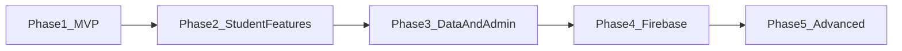
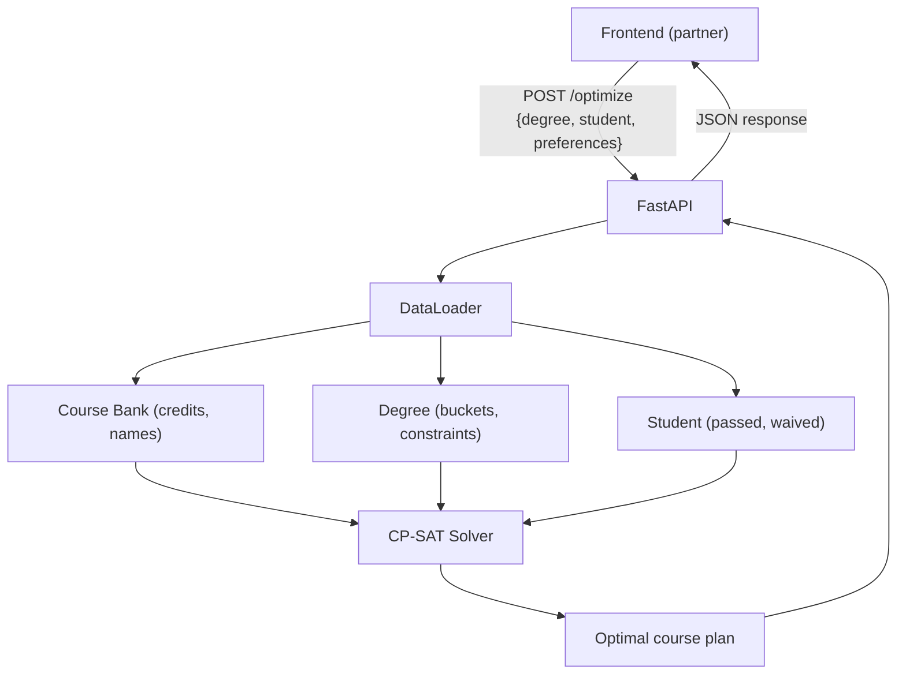
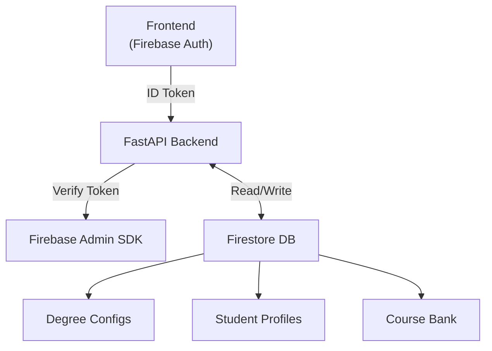

# Optigrade Backend Development Plan

The backend is a Python API that takes degree requirements and a student profile, runs a CP-SAT optimization (OR-Tools), and returns the minimum set of courses the student still needs to take. Development is split into 5 phases.

Reference: [Sogrim](https://github.com/sogrim/technion-sogrim) -- an open-source Technion degree **verification** tool. Optigrade differs by **optimizing** the path to completion, not just checking status.

---

## Phase 1 -- MVP: Core Optimization Engine

Goal: A working `POST /optimize` endpoint that accepts degree + student JSON and returns the optimal course plan.

### 1A. Fix and extend data models

- **Add `total_points_required` and `num_specialties_required` fields** to degree JSON and [classes/degree.py](classes/degree.py). These vary per degree (and per catalog year), so they belong in the degree definition.
- **Hybrid course bank** (inspired by [Sogrim's course bank](https://github.com/sogrim/technion-sogrim) concept):
  - A **central course bank JSON** (`data/course_bank.json`) mapping course IDs to basic info: `{name, credits, is_lab}`. This is shared across degrees and is the single source of truth for course metadata.
  - **Degree JSONs** (like [dummy_degree.json](data/dummy_exampleJSON/dummy_degree.json)) continue to define requirement structure (buckets, allowed IDs, min counts) but do NOT duplicate course metadata.
  - The optimizer joins the two: looks up credits from the bank, structure from the degree.
  - For the MVP, hardcode the course bank for the CSW degree courses only.
- **Fix [classes/degree_registry.py](classes/degree_registry.py)**: it has broken code (undefined decorator, missing imports). Replace with JSON-based loading -- the registry pattern is superseded by the data loader.
- **Fix typo** in `BucketType.FREECHOICE` value: `"faculty chice"` -> `"faculty choice"` in [classes/programs.py](classes/programs.py).

### 1B. Data loading layer

- **Degree loader** (`loaders/degree_loader.py`): reads a degree JSON file and constructs `Faculty`, `Degree`, and `Program_bucket` instances.
- **Student profile loader**: reads student JSON into a `StudentProfile` instance.
- **Course bank loader**: reads the central course bank JSON into a `dict[str, Course]`.
- All loaders should validate inputs and raise clear errors for missing/malformed data.

### 1C. Optimization engine ([optimize.py](optimize.py))

Replace the current pseudocode with a working CP-SAT model:

1. **Variables**: `x[cid]` -- boolean per course (take or not). Fixed to 1 for passed courses, 0 for banned, free for the rest.
2. **Allocation variables**: `alloc[cid][bucket]` -- boolean, course assigned to bucket. Only created for valid (course, bucket) pairs (sparse).
3. **Constraints**:
  - `alloc[cid][b] <= x[cid]` (can only allocate a taken course)
  - Each course allocated to at most 1 bucket
  - Per-bucket minimums (points or course count) using `min_points_count` / `min_courses_count`
  - Mandatory knowledge expressions -- **parse AND/OR logic** from strings like `"044198 and (044202 or 046200)"` into CP-SAT constraints on `x[cid]`
  - Total degree points >= `total_points_required`
  - Number of active specialties == `num_specialties_required` (student can lock specific ones)
4. **Objective**: Minimize total credits of courses NOT already passed.
5. **Solution extraction**: Return which courses to take and their bucket assignments.

### 1D. API layer

- Set up **FastAPI** with a single `POST /optimize` endpoint.
- Request body: degree JSON + student profile JSON + course bank JSON + (optional) locked specialties.
- Response: list of courses to take, bucket assignments, total credits.

---

## Phase 2 -- Student Features

Build on the working optimizer to support the student-facing features from [demands.txt](demands.txt):

- **Exceptions system**: `course_counts_as(course, bucket)`, `override/waiver(bucket, reduce_points)`, `exclude_course(course)`, `force_include_course(course)`. These modify constraints before solving.
- **Planned courses**: Courses the student intends to take (`x[cid] = 1`) but still listed in the output as "planned, not yet completed."
- **Courses to avoid**: `x[cid] = 0` for blacklisted courses.
- **Top-K solutions**: Use CP-SAT solution enumeration to return the top 2 optimal plans.
- **Result document**: Structured output showing all taken courses organized by bucket, exceptions applied, and remaining requirements. If all requirements are already satisfied, output a completion summary instead.

---

## Phase 3 -- Data Management and Admin

- **Course bank management**: CRUD API endpoints for the central course bank (add, update, archive courses). Archived courses are not offered to students but still recognized if already passed.
- **Degree versioning**: Support multiple catalog-year JSONs per degree (e.g., `CSW_2023.json`, `CSW_2024.json`). Student's start semester determines which version applies. Each version can have different `num_specialties_required`.
- **Admin endpoints**: Protected routes for faculty admins to manage degrees and course bank entries.

---

## Phase 4 -- Firebase Integration

- **Firebase Admin SDK**: Add `firebase-admin` to the backend for token verification and Firestore access.
- **Auth middleware**: FastAPI middleware that verifies Firebase ID tokens sent by the frontend.
- **Firestore persistence**: Store student profiles, optimization results, degree configurations, and the course bank in Firestore. The backend reads/writes; the frontend authenticates via Firebase Auth.

---

## Phase 5 -- Advanced Features

- **Substitutions/equivalencies**: Model the `"substitutions"` field from degree JSON. If a student passed an alternative course, it counts as the original in bucket allocation and mandatory knowledge checks.
- **Prerequisite-aware scheduling**: Add prerequisite data to the course bank. After the optimizer selects WHICH courses to take, a second pass assigns them to semesters respecting prerequisite chains. This is a separate scheduling layer on top of the existing set-selection optimizer.
- **Transcript parsing**: Parse Technion English transcript PDFs (like `grades_July25.pdf`) to auto-populate `passed_course_ids`. Extract course IDs, names, and grades from the tabular PDF format.
- **Output document generation**: Export a formatted PDF/report of the degree completion plan.

